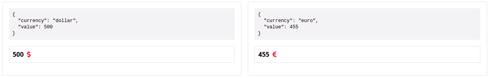

#  Angular Polymorphic Data Experiment

My try of creating universal way to display data. Main concept it that you don't need to know what kind of data 
you have to display it. If you have well-organised data layer it should improve your workflow. No need to know every component in app, just type `<ngx-data [data]="some_data">` and done. 
This component will find the best template for provided object.  

## Install
```
npm i --save ngx-polymorphic-data
```

## Demo
Clone this repo and run like standard angular/cli app. 



## Usage
Create some data components. Remember to extend `NgxPolymorphicDataComponent` class and define `#template` element.
```
@Component({
  selector: 'app-example',
  template: `
    <ng-template #template let-data="data">
      <div class="flex items-center">
        <div class="bg-gray-100 flex-1 h-2 rounded overflow-hidden">
          <div class="bg-blue-500 h-full" [style.width.%]="data.value"></div>
        </div>
        <div class="p-2 text-sm text-gray-500">
          {{ data.value }} %
        </div>
      </div>
    </ng-template>
  `
})
export class ProgressComponent extends NgxPolymorphicDataComponent {
  constructor() {
    super();
  }
}

```
Import the module, add components and define selectors. 
Selectors will be used to math data with components. Object selectors are not recommended for complex data. Use function version instead.
```
@NgModule({
  declarations: [
    AppComponent,
    FullNameComponent,
    PriceDollarsComponent,
    PriceEuroComponent,
    ProgressComponent
  ],
  imports: [
    BrowserModule,
    NgxPolymorphicDataModule.forComponents([
      createPolymorphicData(FullNameComponent, {type: 'fullName'}),
      createPolymorphicData(PriceDollarsComponent, {currency: 'dollar'}),
      createPolymorphicData(PriceEuroComponent, {currency: 'euro'}),
      createPolymorphicData(ProgressComponent, (data) => data.type === 'progress')
    ])
  ],
  bootstrap: [AppComponent]
})
export class AppModule {
}
```
Display the data using `ngx-data` component.
```
<ngx-data [data]="data"></ngx-data>
```

## Edit mode
There is no build-in edit mode. It should be easy to implement, so if you need this feature please create your own implementation.
